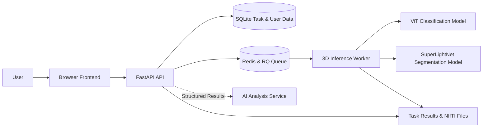

# Brain Tumor MRI Image Analysis

[](LICENSE)
[](https://www.python.org/)
[]()
[]()<br>
[](https://fastapi.tiangolo.com/)
[](https://pytorch.org/)
[](https://developer.nvidia.com/cuda-toolkit)
[](https://redis.io/)

BTIR is a complete analysis system for four‑modality brain tumor MRI.

Users can log in via a browser, run classification, segmentation, and AI-assisted analysis, then inspect key imaging features, slices, comparisons, and 3D imaging in the web page.

Visit our deployed service (occasionally open): https://btir.online/<br>
Also visit our about page: https://btir.xiao-blog.top/

**Other languages:** [中文](README.md)

## Capabilities

| Scope | Capability |
| --- | --- |
| Case Upload | Supports four‑modality NIfTI or raw DICOM folders and ZIP archives. Automatically matches and converts FLAIR, T1CE, T1, T2; provides correction options when NIfTI files are missing or duplicated. |
| Model Analysis | Combines evidence from a local ViT multi‑slice binary classifier and a SuperLightNet 3D segmentation model to generate comprehensive conclusions. |
| Result Display | Keeps the dual-model conclusion, follow-up comparison, and key imaging features in the first view, then provides slice probability curves, segmentation overlays, and expandable region details. |
| 3D Viewer | Switch between four modalities, tri‑planar views, and volume rendering; overlay predicted masks with adjustable opacity. |
| Follow-up & Tasks | Groups historical examinations by case and compares a chosen pair of studies, with asynchronous submission, polling, cancellation, failed retries, run history, archiving, and restoration. |
| Multi‑user | JWT‑based login isolation, user task quotas, mandatory password change, admin user and task management, audit queries. |
| Testing | Unit tests, interface contracts, task flow tests, and optional browser end‑to‑end tests. |
| Deployment & Runtime | SQLite persistence, Redis + RQ queue, CPU, CUDA, and Linux ROCm support; audit logs rotate by size with automatic retention. |

## System Architecture



The frontend does not directly read the database or task directories; all data is obtained through authenticated APIs. 
The AI service receives only local structured quantitative information produced by the models, not the raw user data.

## Workflow

1. Log in with your account.
2. On the upload page, download test samples.
3. Drag a case folder or ZIP archive containing four‑modality NIfTI or raw DICOM.
4. If the system detects missing or duplicate modalities, follow the on‑screen prompts to select or supplement the corresponding files.
5. Start analysis; the page displays upload, queuing, and inference progress.
6. Review results in the order of comprehensive conclusion, follow-up comparison, imaging features, and model evidence.
7. Expand segmentation region details or “Detailed Data” for quantitative fields and file metadata.
8. In the “3D Viewer”, switch modalities, view segmentation masks, or use volume rendering.
9. After uploading a follow-up study for the same case, choose a historical examination on the analysis page for comparison.

The browser must support WebGL2 to use the 3D viewer.<br>
The viewer is based on NiiVue; see [Third‑Party Notices](THIRD_PARTY_NOTICES.md) for license information.

## Quick Start

### 1. Get Model Weights

Model weights are managed with Git LFS:

```bash
git lfs install
git lfs pull
git lfs status
```

Verify that the following files are real weights, not Git LFS pointers:

```text
models/classification/vit-binary/model.safetensors
models/segmentation3d/model/model_epoch_297.pth
```

### 2. Set Up Python Environment

The project requires Python 3.11:

```bash
python3.11 -m pip install -r requirements.txt
cp .env.example .env
python3.11 -c "import secrets; print(secrets.token_urlsafe(48))"
```

Write the randomly generated value from the last command into `BTIR_JWT_SECRET_KEY` in `.env`<br>

For first‑time deployment, create an admin user:

```bash
python3.11 Main.py user create <username> --admin
```

`requirements.txt` uses PyTorch CUDA 12.1 by default.<br>
For CPU, CUDA, ROCm, and Linux deployment options, see [Installation & Deployment](docs/DEPLOYMENT.md).

### 3. Start Redis, API, and Worker

```bash
sudo systemctl start redis-server
```

Start the API and Worker separately:

```bash
python3.11 -m uvicorn api.app:app --reload
python3.11 -m workers.run_worker
```

Alternatively, you can host both the API and Worker simultaneously using the supervisor script:
```bash
bash scripts/run-supervisor.sh /usr/bin/python3.11
```

Then open the following addresses:

- Frontend: <http://127.0.0.1:8000/web/>
- API Docs: <http://127.0.0.1:8000/docs>
- Runtime Info: <http://127.0.0.1:8000/runtime>
- Readiness Probe: <http://127.0.0.1:8000/readyz>

## Models and Results

The system combines classification and segmentation results into a unified `frontend_result.json`:

- The classification model provides case‑level `no/yes` probabilities.
- The segmentation model provides region statistics for NCR/NET, ED, ET, and volumes.
- Comprehensive conclusions primarily use segmentation results, supplemented by classification evidence.
- The AI-assisted analysis interprets only the structured information above and shows conclusions, recommendations, and observations when successful, including the actual provider on the frontend.
- An unavailable AI service does not affect local classification, segmentation, or the comprehensive conclusion.

Classification and segmentation model outputs are independently saved in the task directory for traceability and comparison.  
For detailed result fields and API conventions, see the [API Documentation](docs/API.md).

## Documentation Guide

| Document | Audience | Content |
| --- | --- | --- |
| [API Documentation](docs/API.md) | Frontend & API callers | All endpoints, parameters, responses, errors, and examples |
| [Installation & Deployment](docs/DEPLOYMENT.md) | Developers & operators | Windows, Linux, GPU, Redis, Worker, and process supervision |
| [Operations & Data Management](docs/OPERATIONS.md) | Admins & backend maintainers | Health checks, queues, backup, archiving, audit, cleanup, and benchmarks |
| [Classification Model](models/classification/vit-binary/README.md) | Model maintainers | Case‑level classifier and weight configuration |
| [Segmentation Model](models/segmentation3d/README.md) | Model maintainers | 3D segmentation, labels, and statistics fields |
| [Third‑Party Notices](THIRD_PARTY_NOTICES.md) | Release & compliance | Licenses for third‑party components like NiiVue |

## Testing

Run backend, frontend contract, and task flow tests:

```bash
python3.11 -m pip install -r requirements-dev.txt
python3.11 -m unittest discover -s tests -v
```

Browser end‑to‑end tests use a local mock API and cover login, ZIP upload, asynchronous task submission, retry, cancel, and 3D viewer entry. They do not require model weights, Redis, or the AI service:

```bash
python3.11 -m playwright install chromium
$env:BTIR_RUN_BROWSER_E2E=1
python3.11 -m unittest tests.test_browser_e2e -v
```

If `BTIR_RUN_BROWSER_E2E=1` is not set, the browser tests are skipped automatically.

## 项目结构

```text
frontend/        Browser pages, upload interaction, and 3D viewer
assets/          Static icons and resources
api/             FastAPI application, authentication, and routing
contracts/       API request and response models
processing/      Volume slice preprocessing and classification aggregation
core/            Configuration, task state, and persistence records
services/        Task, inference, queue, locking, archiving, audit, and other business logic
repositories/    SQLite task and user repositories
workers/         RQ inference jobs and worker entrypoint
models/          Classification and segmentation model implementations and weights
accelerator/     CPU, CUDA, ROCm adapters
scripts/         Linux process supervision scripts
tests/           Automated tests
docs/            Deployment, operations, and API documentation
Main.py          Development, debug, and maintenance commands
```

Task inputs, run records, and output files are stored in `output/`. The SQLite database defaults to `data/btir.db`. Archives and audit logs default to `archive/`. These runtime data should not be committed to version control.

The current audit log file is `archive/audit.jsonl`. When it exceeds `BTIR_AUDIT_LOG_MAX_BYTES`, it rotates to historical shards. `BTIR_AUDIT_LOG_RETENTION_DAYS` and `BTIR_AUDIT_LOG_MAX_ROTATED_FILES` control retention of historical shards.

## Development & Maintenance

Common commands:

```bash
python3.11 Main.py help
python3.11 Main.py reconcile-tasks
python3.11 Main.py archive-tasks
python3.11 Main.py purge-archive
python3.11 Main.py claim-legacy-tasks <username> --apply
python3.11 Main.py evaluate-3d <BraTS dataset directory>
python3.11 Main.py clear --dry-run
```
Before performing any actual cleanup, stop the API and Worker, and always use `--dry-run` first to review the scope.<br>
For account maintenance, database migrations, archiving, backups, and audit log rotation strategies, follow [Operations & Data Management](docs/OPERATIONS.md).
