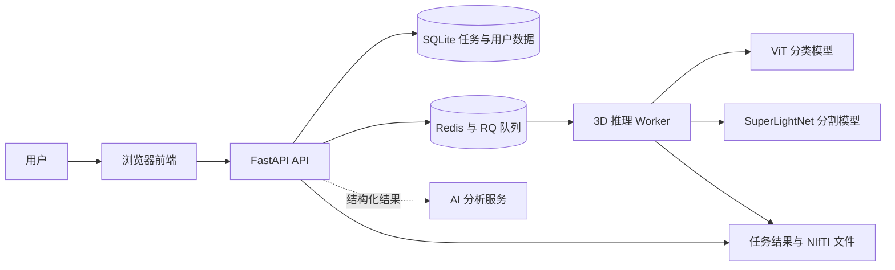

# 脑肿瘤 MRI 图像分析

[](LICENSE)
[](https://www.python.org/)
[]()
[]()<br>
[](https://fastapi.tiangolo.com/)
[](https://pytorch.org/)
[](https://developer.nvidia.com/cuda-toolkit)
[](https://redis.io/)

BTIR 是一个面向四模态脑肿瘤 MRI 的完整分析系统<br>
用户可在浏览器中登录、拖入病例文件夹或 ZIP 压缩包，查看分类、分割、模型综合结论和 AI 结果解读，并在网页内进行 3D 查看<br>
访问我们已经部署好的服务（不定期开放）: https://btir.online/

**其他语言:** [English](README.en.md)

## 项目能力

| 范围 | 能力 |
| --- | --- |
| 病例上传 | 支持四模态 NIfTI 或原始 DICOM 文件夹与 ZIP，自动匹配并转换 FLAIR、T1CE、T1、T2；NIfTI 缺失或重复时提供对应校正项 |
| 模型分析 | 本地 ViT 多切片二分类与 SuperLightNet 3D 分割共同提供证据，生成综合结论 |
| 结果展示 | 展示关键结论、分割区域统计、模型观察、AI 结构化结果解读和建议 |
| 3D 查看 | 切换四模态、三视图与体渲染，叠加预测掩码并调整透明度 |
| 任务管理 | 异步提交、进度轮询、取消、失败重试、运行历史、归档与恢复 |
| 多用户 | JWT 登录隔离、用户任务配额、强制改密、管理员用户与任务管理、审计查询 |
| 测试保障 | 单元测试、接口契约、任务流程与可选浏览器端到端测试 |
| 部署运行 | SQLite 持久化、Redis + RQ 队列、CPU、CUDA 与 Linux ROCm 运行支持，审计日志按大小轮转并自动保留 |

## 系统组成



前端不直接读取数据库或任务目录，所有数据都经由鉴权 API 获取<br>
AI 只接收本地模型产出的结构化定量信息，不获取用户传入的原始数据

## 使用流程

1. 使用账号登录系统
2. 在上传页获取测试样例
3. 拖入一个病例文件夹或 ZIP 压缩包，支持四模态 NIfTI 和原始 DICOM
4. 若系统发现模态缺失或重复，按页面提示选择或补充对应文件
5. 开始分析，页面展示上传、排队与推理进度
6. 查看综合结果、详细数据和可下载文件
7. 在“3D查看”中切换模态、查看分割掩码或体渲染

浏览器需要支持 WebGL2 才能使用 3D 查看<br>
查看器基于 NiiVue，许可证见[第三方软件说明](THIRD_PARTY_NOTICES.md)

## 快速开始

### 1. 获取模型权重

模型权重由 Git LFS 管理：

```bash
git lfs install
git lfs pull
git lfs status
```

确认以下文件是真实权重，而非 Git LFS 指针：

```text
models/classification/vit-binary/model.safetensors
models/segmentation3d/model/model_epoch_297.pth
```

### 2. 配置 Python 环境

项目要求 Python 3.11：

```bash
python3.11 -m pip install -r requirements.txt
cp .env.example .env
python3.11 -c "import secrets; print(secrets.token_urlsafe(48))"
```

将最后一条命令生成的随机值写入 `.env` 的 `BTIR_JWT_SECRET_KEY`<br>

首次部署可创建管理员：

```bash
python3.11 Main.py user create <username> --admin
```

`requirements.txt` 默认使用 CUDA 12.1 版 PyTorch<br>
CPU、CUDA、ROCm 与 Linux 部署方案见[安装与部署](docs/DEPLOYMENT.md)

### 3. 启动 Redis、API 与 Worker

```bash
sudo systemctl start redis-server
```

分别启动 API 与 Worker：

```bash
python3.11 -m uvicorn api.app:app --reload
python3.11 -m workers.run_worker
```

或者可以同时托管 API 与 Worker
```bash
bash scripts/run-supervisor.sh /usr/bin/python3.11
```

随后便可打开以下地址：

- 前端：<http://127.0.0.1:8000/web/>
- API 文档：<http://127.0.0.1:8000/docs>
- 运行设备：<http://127.0.0.1:8000/runtime>
- 完整就绪状态：<http://127.0.0.1:8000/readyz>

## 模型与结果

系统将分类和分割结果组合为统一的 `frontend_result.json`：

- 分类模型提供病例级 `no/yes` 概率
- 分割模型提供 NCR/NET、ED、ET 等区域及体积统计
- 综合结论以分割结果为主要证据，分类结果为补充
- AI汇总服务只解读上述结构化信息并在前端标出分析提供方

分类与分割模型会以独立运行记录保存在任务目录中，方便追溯和对比<br>
详细结果字段和 API 约定见[API 对接说明](docs/API.md)

## 文档导航

| 文档 | 对象 | 内容 |
| --- | --- | --- |
| [API 对接说明](docs/API.md) | 前端与接口调用者 | 所有接口、参数、响应、错误与调用示例 |
| [安装与部署](docs/DEPLOYMENT.md) | 开发与部署人员 | Windows、Linux、GPU、Redis、Worker 与进程守护 |
| [运维与数据管理](docs/OPERATIONS.md) | 管理员与后端维护者 | 健康检查、队列、备份、归档、审计、清理与基准 |
| [分类模型说明](models/classification/vit-binary/README.md) | 模型维护者 | 病例级分类模型与权重配置 |
| [分割模型说明](models/segmentation3d/README.md) | 模型维护者 | 3D 分割、标签与统计字段 |
| [第三方软件说明](THIRD_PARTY_NOTICES.md) | 发布与合规人员 | NiiVue 等第三方组件的许可证 |

## 测试

常规后端、前端契约和任务流程测试：

```bash
python3.11 -m pip install -r requirements-dev.txt
python3.11 -m unittest discover -s tests -v
```

浏览器端到端测试使用本地模拟 API，覆盖登录、ZIP 上传、异步任务提交、重试、取消与 3D 查看入口，不依赖模型权重、Redis 或 AI接口：

```bash
python3.11 -m playwright install chromium
$env:BTIR_RUN_BROWSER_E2E=1
python3.11 -m unittest tests.test_browser_e2e -v
```

未设置 `BTIR_RUN_BROWSER_E2E=1` 时，浏览器用例会自动跳过

## 项目结构

```text
frontend/        浏览器页面、上传交互与 3D 查看
assets/          页面图标等静态资源
api/             FastAPI 应用、鉴权和路由
contracts/       API 请求与响应模型
processing/      体积切片预处理与分类聚合
core/            配置、任务状态和持久化记录
services/        任务、推理、队列、锁、归档、审计等业务逻辑
repositories/    SQLite 任务与用户仓储
workers/         RQ 推理作业与 Worker 入口
models/          分类、分割模型实现与权重
accelerator/     CPU、CUDA、ROCm 适配
scripts/         Linux 进程守护脚本
tests/           自动化测试
docs/            部署、运维与 API 文档
Main.py          开发调试和维护命令
```

任务输入、运行记录和输出文件位于 `output/`，SQLite 数据库默认位于 `data/btir.db`，归档与审计日志默认位于 `archive/`<br>
这些运行数据不应提交到版本库

审计日志的当前写入文件为 `archive/audit.jsonl`<br>
超过 `BTIR_AUDIT_LOG_MAX_BYTES` 时会轮转为历史分片<br>
`BTIR_AUDIT_LOG_RETENTION_DAYS` 和 `BTIR_AUDIT_LOG_MAX_ROTATED_FILES` 控制历史分片的保留范围

## 开发与维护

常用命令：

```bash
python3.11 Main.py help
python3.11 Main.py reconcile-tasks
python3.11 Main.py archive-tasks
python3.11 Main.py purge-archive
python3.11 Main.py claim-legacy-tasks <username> --apply
python3.11 Main.py evaluate-3d <BraTS数据集目录>
python3.11 Main.py clear --dry-run
```

执行实际清理前必须先停止 API 与 Worker，并先使用 `--dry-run` 检查范围<br>
账号维护、数据库迁移、归档、备份和审计日志轮转策略请遵循[运维与数据管理](docs/OPERATIONS.md)
