# 测试数据下载及使用指南

## 下载

用户可在当前页面右上角点击`下载测试样例`下载测试样例压缩包至本地

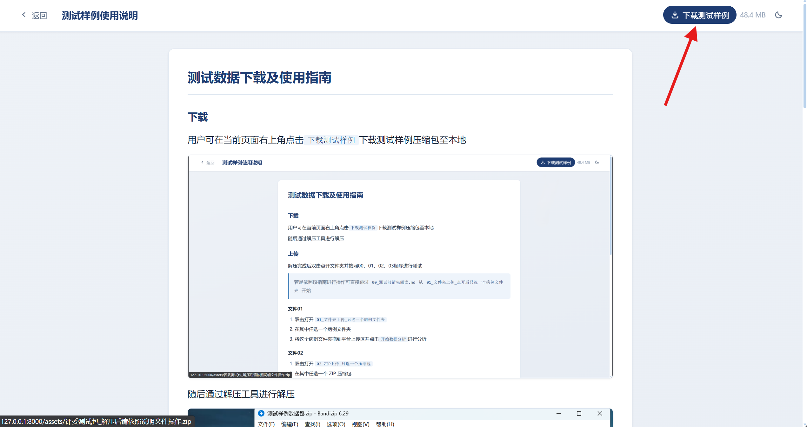

随后通过解压工具进行解压

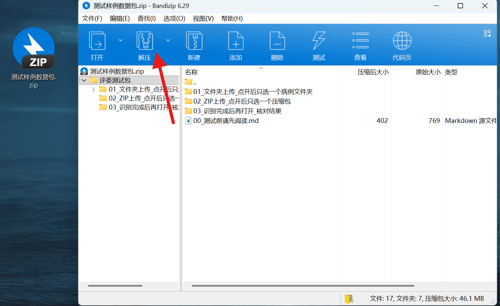

## 上传

解压完成后双击点开文件夹并按照00、01、02、03顺序进行测试
> 若是依照该指南进行操作可直接跳过 `00_测试前请先阅读.md` 从 `01_文件夹上传_点开后只选一个病例文件夹` 开始

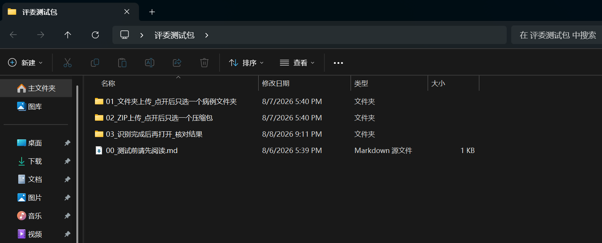

### 文件01

1. 双击打开 `01_文件夹上传_只选一个病例文件夹`
2. 在其中任选一个病例文件夹
3. 将这个病例文件夹拖到平台上传区并点击`开始数据分析`进行分析

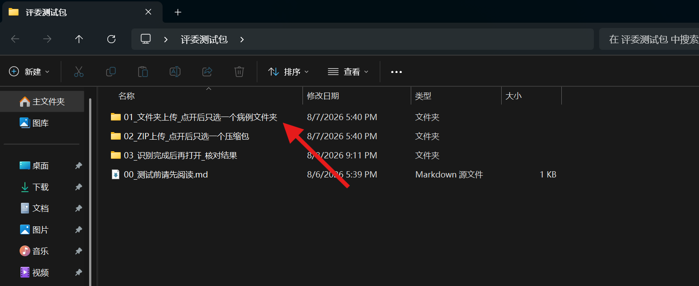

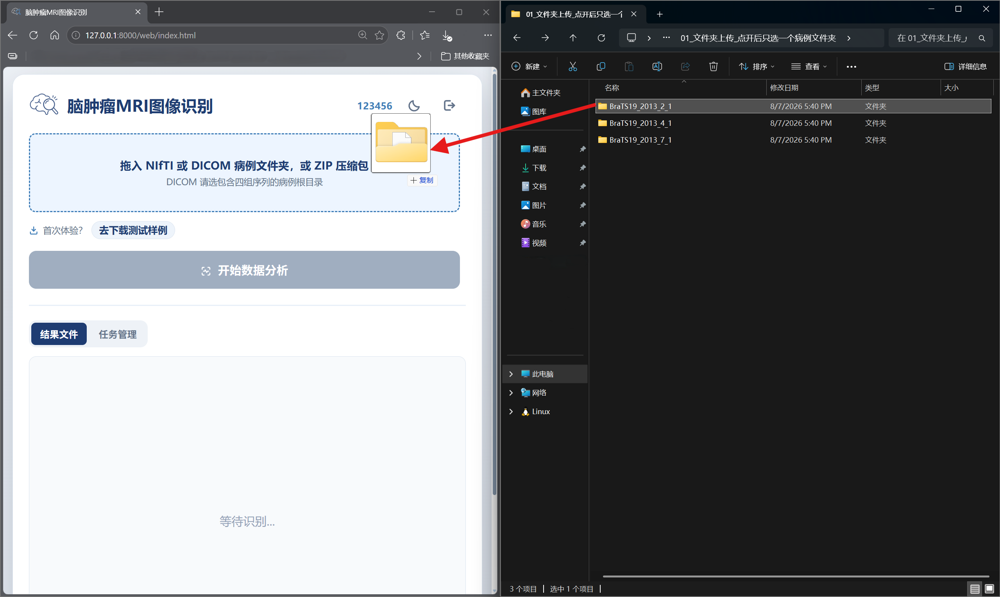

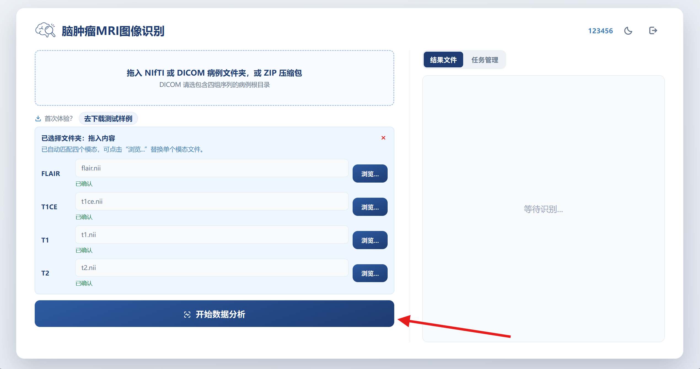

### 文件02

1. 双击打开 `02_ZIP上传_只选一个压缩包`
2. 在其中任选一个 ZIP 压缩包
3. 将这个 ZIP 压缩包拖到平台上传区点击`开始数据分析`进行分析

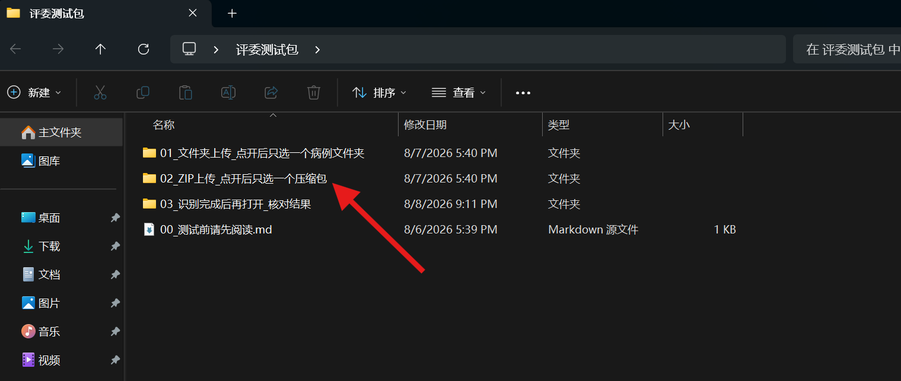

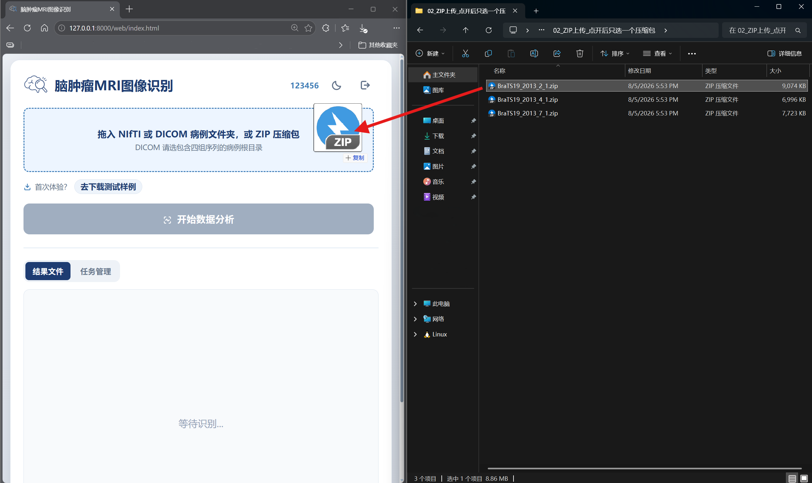

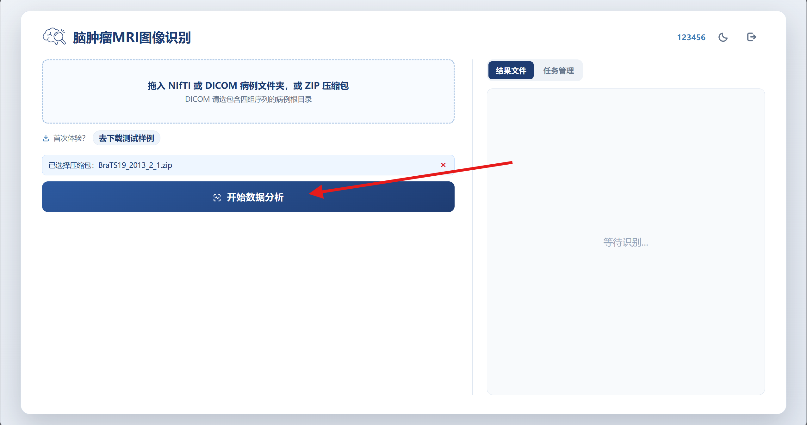

两种方式的病例内容相同，任选一种上传方式即可

### 查看分析结果

分析结束后用户可见如图界面

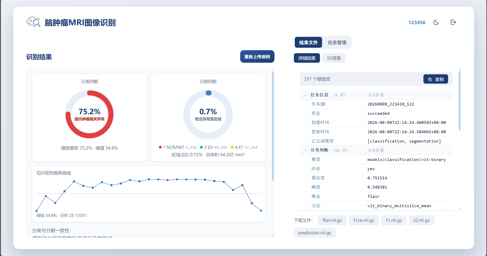

左侧为`识别结果`，包含`分类判断`、`分割判断`、`切片阳性概率曲线`、以及`AI分析结论`等等

用户可点击左下`查看详细数据`查看分割模型的具体结果

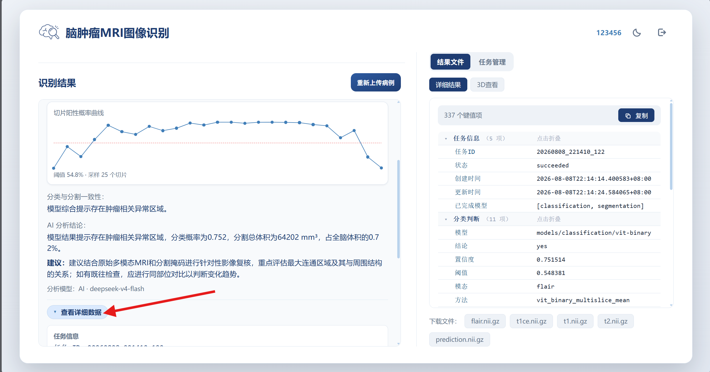

右侧为`详细结果`与`3D查看`

用户可在`详细结果页`查看分析过程的每一个进程细节，以及最终结果

同时可点击`3D查看`更直观了解影像图

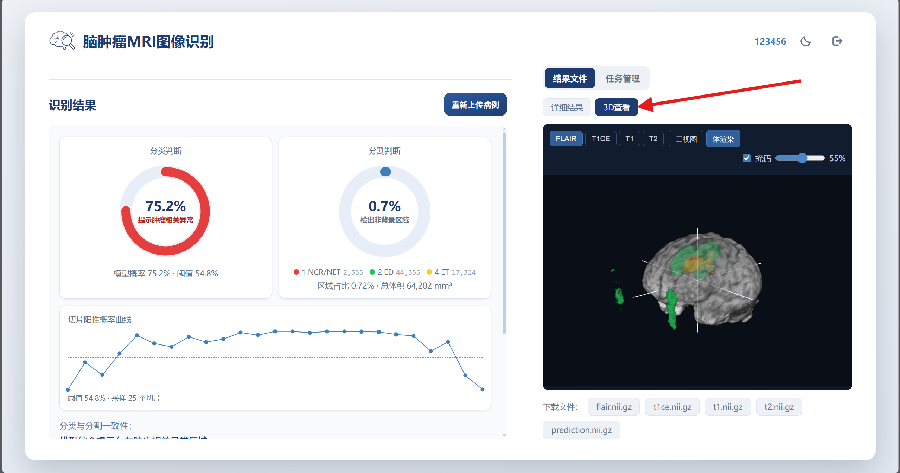

若用户想进行别的数据测试可点击左侧`重新上传病例`按键，随后依照上述流程继续进行测试

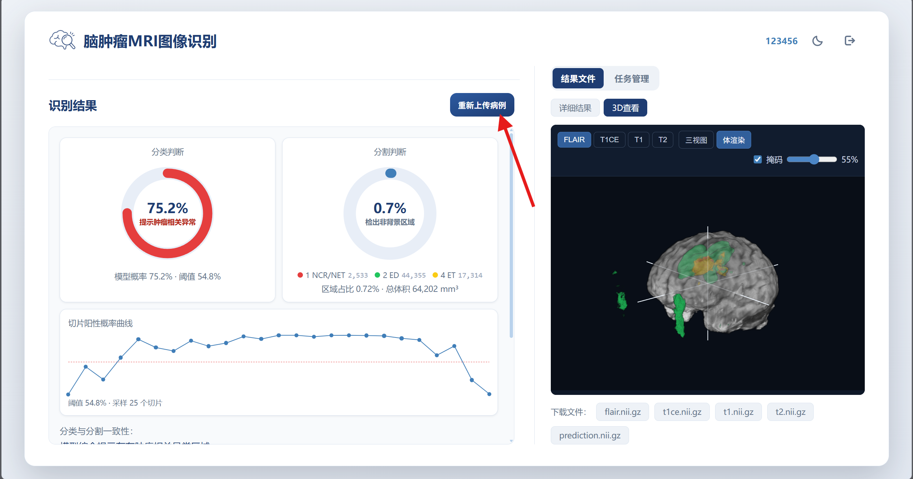

## 核对

识别完成后，打开 `03_识别完成后再打开_核对结果` 内的`预期结果.csv`，查看预期结果
> 该文件可通过 `Excel` 查看

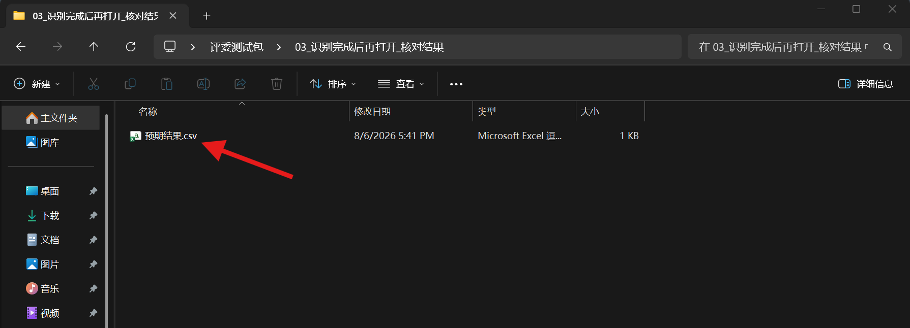

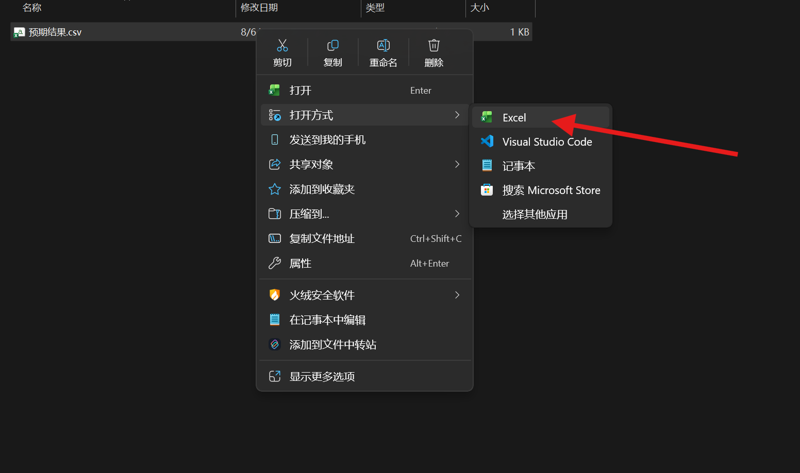

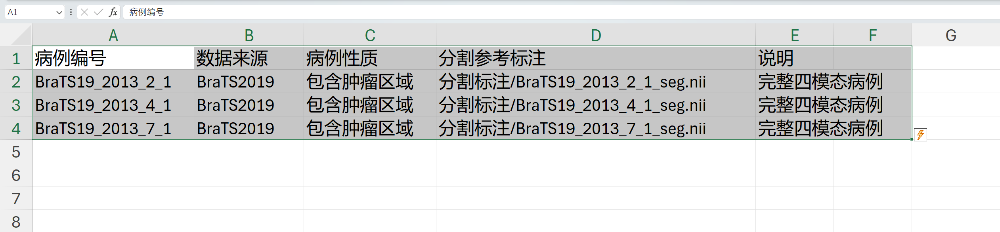

至此样例测试流程结束
